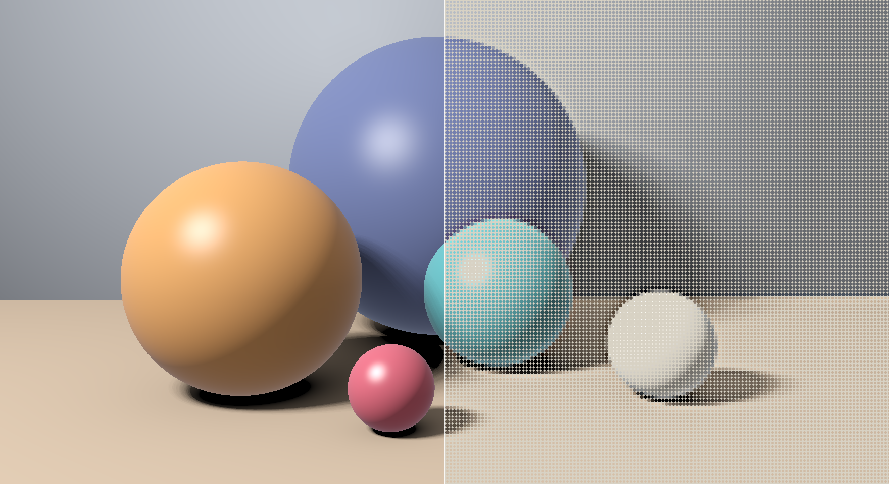
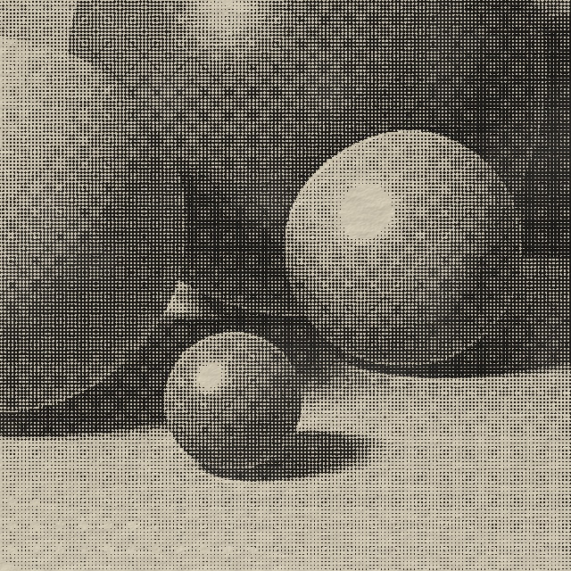
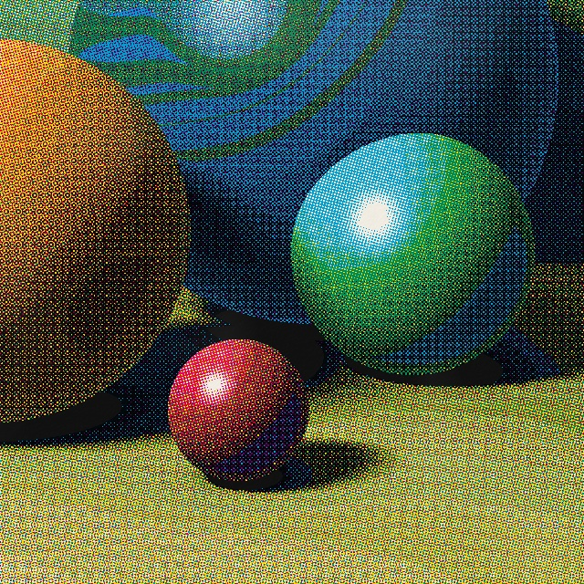
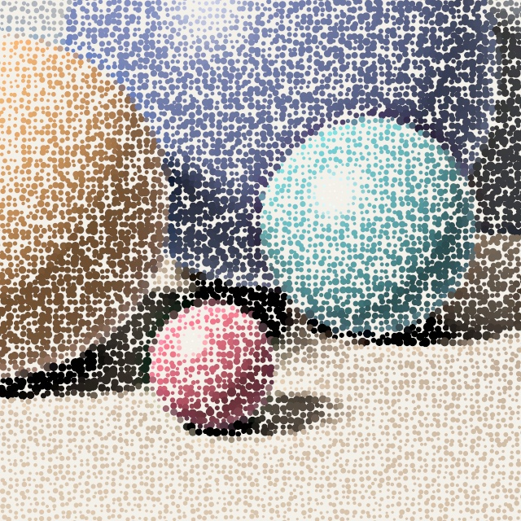
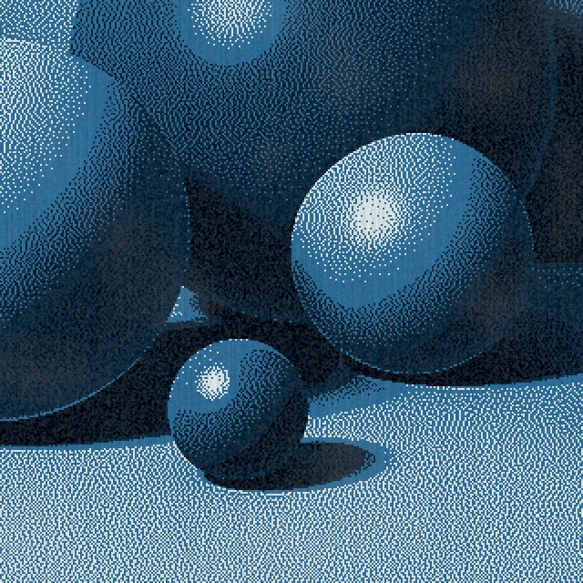
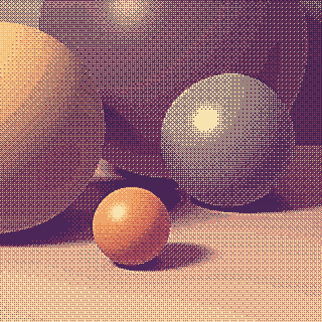
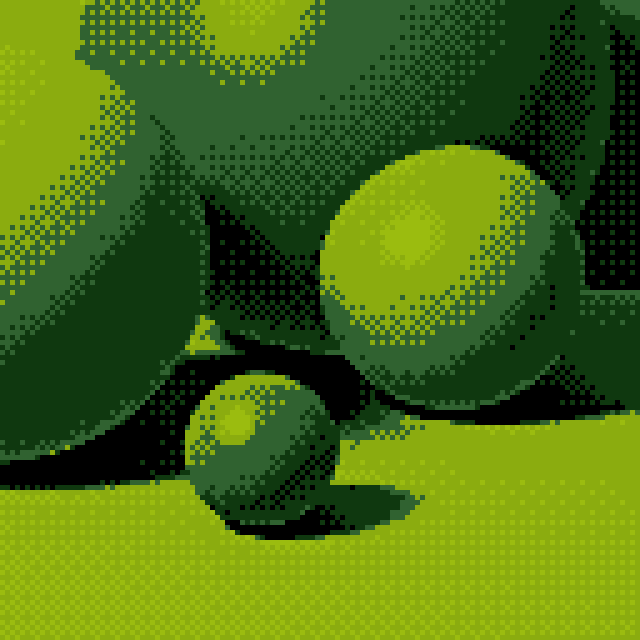
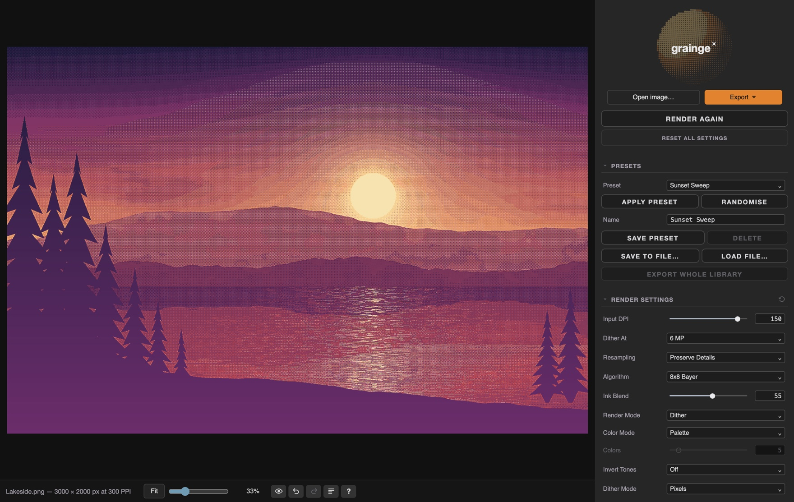
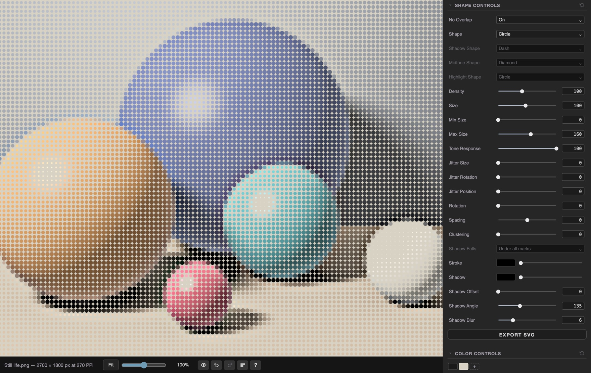

# Grainge

  
   
  Left, the picture. Right, the same picture with the Halftone Dots preset.

Grainge turns a photograph into a print: dither, halftone, shapes and film
grain, in the inks you choose, on paper you can see.

**[Download Grainge for Mac](https://github.com/Excaliburke/grainge-releases/releases/latest)**
&nbsp;·&nbsp; macOS 12 or later

## What it makes

Every one of these started as the same picture. Each is a close-up of one of
the built-in presets, straight out of Grainge.

<table>
  <tr>
    <td width="33%"></td>
    <td width="33%"></td>
    <td width="33%"></td>
  </tr>
  <tr>
    <td><b>Newsprint Halftone</b> Halftone, black ink on newsprint</td>
    <td><b>Process Colour</b> Halftone in cyan, magenta, yellow and black</td>
    <td><b>Stipple Ink</b> Shapes, in the picture's own colours</td>
  </tr>
  <tr>
    <td></td>
    <td></td>
    <td></td>
  </tr>
  <tr>
    <td><b>Cyanotype</b> Dither in cyanotype blues on laid paper</td>
    <td><b>Sunset Sweep</b> Dither in five sunset colours</td>
    <td><b>Game Boy</b> Dither in four greens</td>
  </tr>
</table>

## Working on a picture

Start from a preset, or set every control yourself. After the first render,
the picture follows along as you change things.

Zoom in to see every dot. In Shapes, the picture is drawn in circles, crosses,
stars, hearts and dozens more, at whatever size and spacing you like.

## Download

Get the newest version from
[Releases](https://github.com/Excaliburke/grainge-releases/releases/latest).
Download **`Grainge-<version>.dmg`**, open it, and drag Grainge to your
Applications folder.

The `.zip` on each release is what Grainge uses to update itself. You don't
need to download it.

Grainge runs on macOS 12 or later, on Apple silicon and Intel Macs. Apple has
checked it, so it opens without a security warning.

## Opening a picture

Drop an image onto the window, or right-click an image in Finder and choose
**Open With → Grainge**.

## Updates

When a new version is out, Grainge tells you when it opens, shows you what
changed, and offers to install it. You can also check at any time with
**Grainge → Check for Updates**.

What changed in each version is on the
[Releases](https://github.com/Excaliburke/grainge-releases/releases) page.
